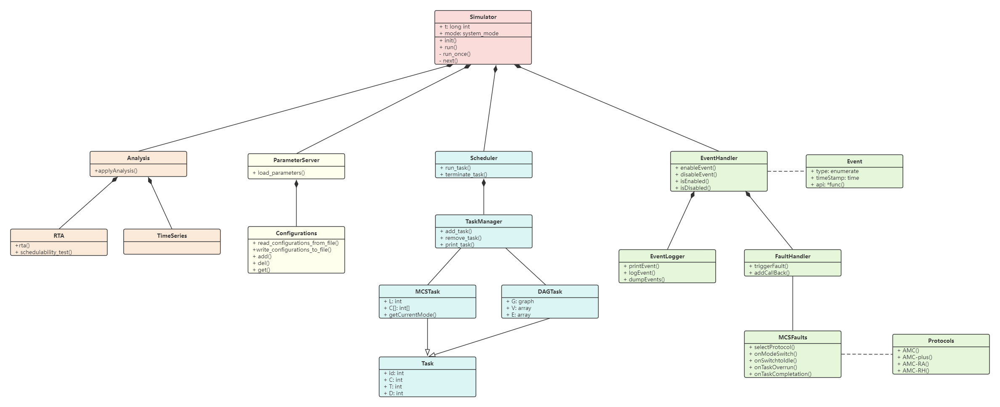
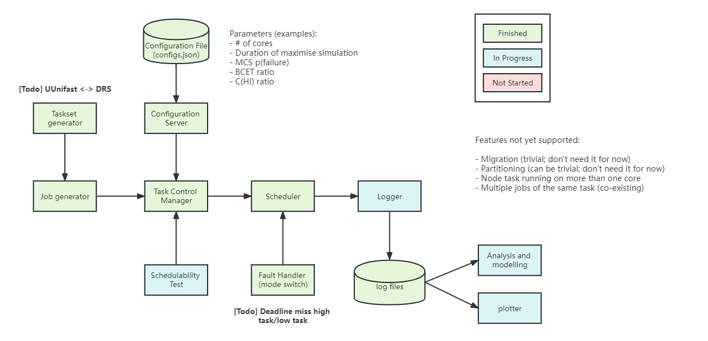

# mcs-simu
An extensible simulator for multi-core mixed-criticality systems task scheduling and allocation research.

## Project Organization
- `/doc`: folder contains all documents
- `/src`: folder contains all source code
  - `main.py`: the main entry
  - `simulator.py`: functions related to simulation
  - `sched.py`: scheduling-related
  - `pa.py`: priority assignment
  - `task.py`: the task class
  - `events.py`: the event class
  - `logger.py`: logging functions
  - `plot_*.py`: plotting-related functions
  - `utility.py`: utility functions
  - `configurations.py`: functions related to parameters
- `config.json`: configurations
- `requirements.txt`
- `LICENSE`: license doc

## Configurations
- `rnd_seed`: the random seed to control reproducibility
- `debug_level`: to decide which debug message to print 
  - -1 (off), 
  - 0 (Critical), 
  - 1 (Error), 
  - 2 (Warning), 
  - 3 (Info), 
  - 4 (Detail),
  - 5 (Everything)
- `preemptive`: 
  - true (preemptive) or 
  - false (non-preemptive)
- `log_on`: 
  - true (write to log files) or
  - false (not to write to log files)

## Log file format
Logs are saved in `/logs`", which are organized as follows:

- `{total_util}/{trial_id}/{policy_id}/log.csv`: {trial_id, timestamp, event_id, event_parameter}
- `{total_util}/{trial_id}/{policy_id}/raw.csv`: {trial_id, timestamp, task_id, response_time, execution_time, slack}
- `{total_util}/{trial_id}/{policy_id}/statistics.csv`: {trial_id, jne1, jne2, jne3, ldm1, ldm2, ldm3, hdm1, hdm2, hdm3}

The `{total_util}` is the total utilization of all the tasks in the taskset. A change is injected at `{trigger_point}` of the simulation. The `_raw` is the data contains response time, and the other dataset records sparse discrete events.

## System-level Design of MCS-Simu

## Flow-chart of MCS-Simu

